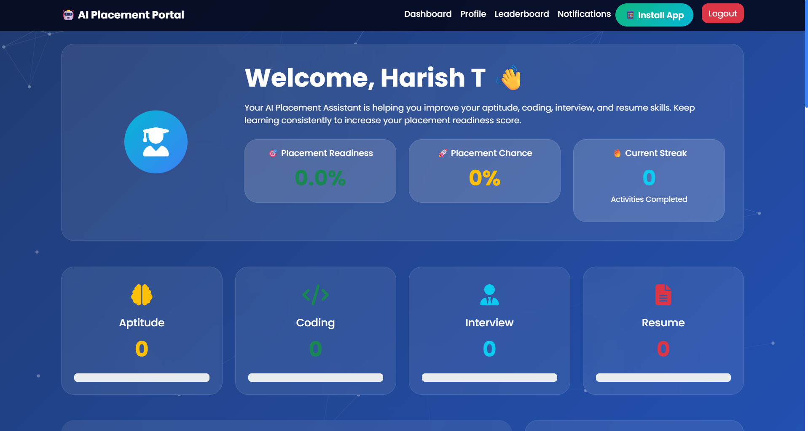

# 🤖 AI-Powered Placement Preparation and Career Guidance Portal

An AI-powered web application designed to help students prepare for campus placements through aptitude practice, coding challenges, mock interviews, resume analysis, career guidance, and personalized learning. Powered by **Google Gemini AI**, the platform provides an interactive and intelligent placement preparation experience.



---

## 🚀 Live Demo

🌐 **Live Website**

👉 **https://ai-powered-placement-preparation-and.onrender.com/**

---

## 📖 About

The **AI-Powered Placement Preparation and Career Guidance Portal** is a comprehensive web application that empowers students to prepare effectively for campus placements. It integrates Artificial Intelligence to provide personalized learning, AI-generated assessments, coding practice, interview preparation, resume optimization, study planning, and performance tracking—all in a single platform.

---

## ✨ Features

- 🤖 AI Career Coach
- 🧠 AI Aptitude Question Generator
- 💻 AI Coding Question Generator
- 🎤 AI Mock Interview
- 🎙️ AI Voice Interview
- 👨‍💼 AI Technical Interview
- 📄 AI Resume Analyzer (ATS Score)
- 📝 AI Resume Builder
- 📚 AI Study Planner
- 📈 Placement Readiness Prediction
- 📊 Performance Analytics Dashboard
- 📉 Weakness Analysis & Personalized Suggestions
- 🏆 Student Leaderboard
- 🎖️ Certificate Generation
- 🔔 Notifications & Activity History
- 🔐 Secure Authentication System
- 👨‍💻 Admin Dashboard
- 📱 Fully Responsive Design
- ⚡ Progressive Web App (PWA) Support

---

# 🛠️ Tech Stack

### Frontend

- HTML5
- CSS3
- Bootstrap 5
- JavaScript

### Backend

- Python
- Flask
- SQLAlchemy

### Database

- SQLite
- PostgreSQL (Production Ready)

### Artificial Intelligence

- Google Gemini AI

### Libraries

- Flask-Login
- Flask-Bcrypt
- Chart.js
- ReportLab
- PyPDF2
- Email Validator

### Development Tools

- Visual Studio Code
- Git
- GitHub

---

# 📂 Project Structure

```text
AI-Powered-Placement-Preparation-and-Career-Guidance-Portal/

│
├── app.py
├── config.py
├── extensions.py
├── requirements.txt
├── runtime.txt
├── Procfile
├── README.md
│
├── models/
├── static/
│   ├── css/
│   ├── js/
│   ├── images/
│   └── sw.js
│
├── templates/
│
├── utils/
│
├── uploads/
│
└── preview.png
```

---

# 📁 Modules

## 👨‍🎓 Student Module

- Student Registration & Login
- Profile Management
- Personalized Dashboard
- Progress Tracking
- Notifications
- Activity History

---

## 🧠 AI Learning Module

- AI Aptitude Generator
- AI Coding Generator
- AI Career Coach
- AI Study Planner
- Weakness Analyzer

---

## 🎤 Interview Module

- AI Mock Interview
- AI Voice Interview
- AI Technical Interview
- AI Interview Evaluation
- Personalized Feedback

---

## 📄 Resume Module

- Resume Builder
- Resume Analyzer
- ATS Score Calculation
- Skill Detection
- Resume PDF Generation

---

## 📊 Analytics Module

- Performance Dashboard
- Placement Readiness Prediction
- Progress Reports
- Score Analytics
- Student Leaderboard

---

## 👨‍💻 Admin Module

- Admin Dashboard
- Student Management
- Question Management
- Performance Monitoring
- Analytics Dashboard

---

# 🌟 Key Features

### 🤖 AI Career Coach

Provides personalized career guidance, interview tips, resume suggestions, and placement advice using Google Gemini AI.

---

### 🧠 AI Aptitude Test

Generates AI-powered aptitude questions based on selected topics and difficulty levels.

---

### 💻 AI Coding Practice

Creates coding interview questions across multiple programming languages with varying difficulty levels.

---

### 🎤 AI Interview Evaluation

Evaluates interview responses and provides AI-generated feedback and improvement suggestions.

---

### 📄 Resume Analyzer

Analyzes uploaded resumes, detects technical skills, and calculates ATS compatibility scores.

---

### 📊 Performance Analytics

Displays progress, strengths, weaknesses, and placement readiness using interactive charts and analytics.

---

# 📱 Responsive Design

Optimized for:

- 💻 Desktop
- 💼 Laptop
- 📱 Mobile
- 📟 Tablet

---

# ⚡ Performance

- Fast Loading
- Fully Responsive
- AI-Powered Features
- Interactive Dashboard
- Modern UI/UX
- Clean & Modular Code
- Progressive Web App (PWA)

---

# ⚙️ Installation

## Clone the Repository

```bash
git clone https://github.com/harish-t24/AI-Powered-Placement-Preparation-and-Career-Guidance-Portal.git
```

## Navigate to the Project

```bash
cd AI-Powered-Placement-Preparation-and-Career-Guidance-Portal
```

## Create a Virtual Environment

```bash
python -m venv venv
```

## Activate the Virtual Environment

### Windows

```bash
venv\Scripts\activate
```

### Linux / macOS

```bash
source venv/bin/activate
```

## Install Dependencies

```bash
pip install -r requirements.txt
```

## Configure Environment Variables

Create a `.env` file in the project root.

```env
SECRET_KEY=your_secret_key
GOOGLE_API_KEY=your_gemini_api_key
```

## Run the Application

```bash
python app.py
```

Visit:

```text
http://127.0.0.1:5000
```

---

# 🚀 Future Enhancements

- 🌙 Dark / Light Theme
- 📱 Android & iOS Application
- 📧 Email Notifications
- 🌐 Multi-language Support
- ☁️ Cloud Database Integration
- 🎥 AI Video Interview Evaluation
- 🏢 Company-Specific Placement Roadmaps
- 👥 Student Discussion Forum
- 📈 Advanced Analytics Dashboard
- 💼 Job Portal Integration

---

# 📬 Contact

**Harish T**

📧 **Email:** harish.t7708@gmail.com

🌐 **Portfolio:** https://harish-t24.github.io/Portfolio/

💻 **GitHub:** https://github.com/harish-t24

💼 **LinkedIn:** https://www.linkedin.com/in/harish-t7708

📍 **Location:** Puducherry, India

---

# 🤝 Contributing

Contributions, suggestions, and feature requests are welcome.

If you would like to contribute:

1. Fork the repository
2. Create a feature branch
3. Commit your changes
4. Push to your branch
5. Open a Pull Request

---

# ⭐ Support

If you found this project useful, please consider giving it a ⭐ **Star** on GitHub.

---

# 📄 License

This project is licensed under the **MIT License**.

---

# 👨‍💻 Developed By

## **Harish T**

**Python Developer • Full Stack Developer • AI Enthusiast • Cloud Computing Learner**

> *"Empowering students with AI-driven placement preparation to build confidence, enhance skills, and achieve career success."*
